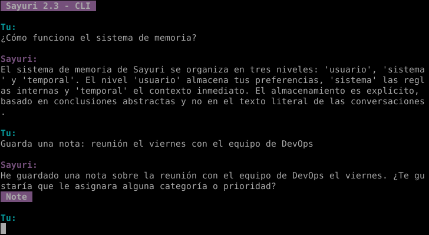

# Sayuri v2.3 - Advanced AI Assistant with Dual-LLM Architecture



An intelligent CLI assistant featuring a sophisticated dual-LLM system: one model analyzes intent and context, while another generates personality-driven responses. Includes persistent memory management, structured note-taking, and adaptive conversation flow.

## 🏗️ Architecture Highlights

### Dual-LLM System
- **Intent Analyzer**: Processes user input to determine mode, technical level, correction needs, and response parameters
- **Personality Engine**: Generates contextually appropriate responses based on intent analysis and conversation history

### Intelligent Memory System
- **Multi-Scope**: User preferences, system config, temporary context
- **Multi-Level**: Short, medium, and long-term retention
- **Importance Weighting**: Prioritizes critical information
- **Tag-Based Organization**: Semantic categorization

### Structured Note-Taking
- Automatically extracts and saves structured information from conversations
- Category, priority, and status management
- Tag-based retrieval system

## ✨ Key Features

- 🧠 **Context-Aware Responses**: Maintains conversation history and adapts tone
- 💾 **Persistent Memory**: Remembers user preferences and important information across sessions
- 📝 **Automatic Note Creation**: Extracts and structures information from natural conversation
- 🎭 **Adaptive Personality**: Adjusts technical depth, tone, and emoji usage based on context
- 📊 **Complete Logging**: Full LLM request/response audit trail
- 🔧 **Modular Architecture**: Clean separation of concerns for maintainability

## 🛠️ Tech Stack

- **Python 3.14**
- **Google Gemini API** (dual models)
- **SQLite** (memory, notes, history, logs)
- **prompt_toolkit** (rich CLI interface)

## 📋 Prerequisites

- Python 3.8+
- Google Gemini API key ([get one here](https://makersuite.google.com/app/apikey))

## 🚀 Installation

1. Clone the repository
```bash
git clone https://github.com/lionelponce/sayuri-v2.git
cd sayuri-v2
```

2. Install dependencies
```bash
pip install -r requirements.txt
```

3. Configure API key
```bash
cp config.json.example config.json
# Edit config.json and add your Gemini API key
```

4. Run Sayuri
```bash
python main.py
```

## 📖 Usage

### Basic Conversation
```
Tu: ¿Cómo funciona el sistema de memoria?

Sayuri: El sistema tiene tres niveles de retención basados en importancia...
```

### Note Creation
```
Tu: Guarda una nota: reunión el viernes con el equipo de DevOps

Sayuri: [Nota guardada] 📝
```

### Factory Reset
```
Tu: factory_reset

[Resets all databases and starts fresh]
```

## 🗂️ Project Structure
```
sayuri_v2/
├── main.py              # CLI interface
├── config.json          # Configuration (API keys, models)
├── requirements.txt     # Dependencies
├── sayuri/
│   ├── core.py         # Main orchestration logic
│   ├── database.py     # Database context manager
│   ├── googleapis.py   # Gemini API integration
│   ├── memory.py       # Memory management
│   ├── notes.py        # Note-taking system
│   ├── history.py      # Conversation history
│   └── llmlogs.py      # LLM request/response logging
├── prompts/
│   ├── personality.txt # Personality engine prompt
│   └── intention.txt   # Intent analyzer prompt
├── databases/          # SQLite databases (auto-created)
└── logs/              # LLM interaction logs
```

## 🧩 How It Works

### 1. Intent Analysis
When you send a message, the **Intent Analyzer** determines:
- Interaction mode (casual, technical, correction, support)
- Required technical depth (low, medium, high)
- Response length and tone
- Whether to store memory or create notes

### 2. Memory Management
The system automatically stores important information:
```json
{
  "scope": "user",
  "level": "long",
  "content": "Prefers Python over JavaScript",
  "importance": 3,
  "tags": ["preference", "programming"]
}
```

### 3. Adaptive Response
The **Personality Engine** generates responses tailored to:
- Detected intent
- Relevant memories
- Conversation history
- User preferences

## 🎯 Use Cases

- **Personal Assistant**: Remembers preferences, manages notes
- **Technical Companion**: Adapts explanations to your skill level
- **Learning Tool**: Stores knowledge and retrieves context
- **Conversation Partner**: Natural, context-aware dialogue

## 🔒 Privacy

- **Local-First**: All data stored locally in SQLite
- **No Cloud Storage**: Conversations stay on your machine
- **API Privacy**: Only sends necessary context to Gemini API

## 🚧 Roadmap

- [ ] Web interface
- [ ] Voice interaction (TTS/STT)
- [ ] Multi-user support
- [ ] Plugin system for custom skills
- [ ] Export/import memory and notes

## 📄 License

GNU GPL v3.0 License

## 👤 Author

**Lionel Ponce**
- GitHub: [@lionelponce](https://github.com/lionelponce)

---

*Built to explore advanced AI architectures and human-AI interaction patterns.*